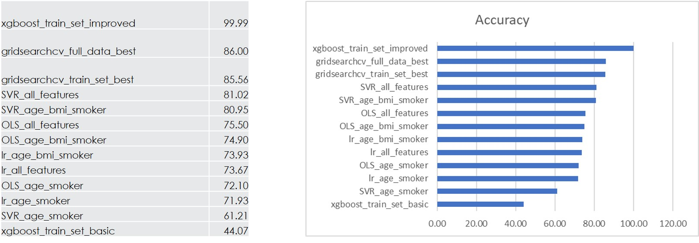

# Predicting Annual Medical Expenses
#### Chris Richards
#### Practicum 1, Summer 2020
#### Regis University

## Project goal
The goal of this project was to create various models and assess their usefulness in predicting the annual dollar amount of health care spending.  

## Resources
* Anaconda 3
* Python 3
* Jupyter Notebooks  

## Libraries: 
* Pandas - data analysis and manipulation
* numpy - array processing
* sci-kit learn - modules for machine learning
* pandas profiling - automated exploratory data analysis
* graphviz - displaying decision trees
* seaborn - data visualization library
* matplotlib - plotting
* xgboost - extreme gradient boosting module
* phik - correlation analyzer package
* statsmodels  - statistical computation and models
* scipy - scientific computation

## Data Overview
Data for this project was taken from the book, "Machine Learning with R", by Brett Lantz.  It is available for download on Kaggle.com and on github at: https://github.com/stedy/Machine-Learning-with-R-datasets/blob/master/insurance.csv

The data itself consists of 1,337 rows and the following features:  
* age: age of primary beneficiary
* sex: female, male
* bmi: Body mass index
* children: Number of children covered by health insurance / Number of dependents
* smoker: Smoking?
* region: the beneficiary's residential area in the US, northeast, southeast, southwest, northwest.
* charges: Individual medical costs billed by health insurance

## Exploratory Data Analysis (EDA)
Typical EDA activities were performed including:
* Quantitative stats
* Checking for null values and mitigating
* Pairs plot for correlations
* Checking for duplicates and mitigating
* Detecting outliers using boxplots and scatterplots
* Distributions using histograms
  
 Detailed steps can be found in the practicum_eda.ipynb notebook in this repository.
 
 ## Feature Engineering
 Feature engineering was light.  An extraneous index column was removed from the initial data set.  Categorical features were encoded using different techniques.  
 
 Features that were poorly correlated with the target variable, "charges", were removed and saved for later model building.  
 
 An additional feature, "weight category", based on the BMI categories was added as part of the EDA process.  The categories were used for analysis of the relationship between BMI categories and several other features, including "charges.  Visualizations of the analysis can be found in the EDA notebook.
 
 Detailed feature engineering steps can be found in the practicum_feature_engineering_2.ipynb notebook in this repository.  
   
 ## Models: Linear Regression and Support Vector Regression (SVR)
 The first attempts at model building for this project were performed using regression models from several libraries.  
 The models were:  
* Linear regression model (scikit-learn)
* Polynomial Regression model using SVR (scikit-learn)
* Linear regression model (statsmodels)

Data used for the model building was divided with 70% used for training and the remaining 30% for testing.  The models were then fitted using the training data set and predictions made on the test data set.  Accuracy using the R2 scoring metric was recorded.  

Each of the models was fitted using data containing different features.  One set of data consisted of the complete feature set, another set contained only "age" and "smoker", while the third set added "bmi" to "age" and "smoker".

In addition, feature importance based on each model was visualized.  

Detailed steps can be found in the following notebooks in this repository:  
* practicum_linear_regression_all_features_2.ipynb
* practicum_linear_regression_age_and_smoker_2.ipynb
* practicum_linear_regression_age_bmi_smoker_2.ipynb

## Models: XGBoost
The extreme gradient boosting (XGBoost) algorithm was implemented for the second round of model building.  The XGBoost algorithm is capable of both classification and regression modeling.  This project implemented it as a regressor similar to the earlier linear and polynomial regression experiments.  Unlike the earlier models, XGBoost uses decision trees to arrive at predictions.  The trees are "boosted" in that the algorithm seeks to improve on earlier trees by learning from their mistakes.  
  
Two XGBoost models were implemented.  The first used a set of parameters of low values as a "baseline".  The second model's hyperparameters were tuned for optimizing the accuracy scoring metric.  In addition, the final boosted tree of each model was visualized.

Data for this model followed the earlier 70/30 split of testing and training sets.  The complete set of features was used for both models.
  
Detailed steps can be found in the practicum_xgboost_models_1_and_2.ipynb notebook in this repository.  
## Models:  GridsearchCV (XGBoost)
The third set of model building experiments utilized the GridsearchCV method.  GridsearchCV allows the user to specify a set, or "grid", of hyperparameters to use for model building.  It then iterates through each combination of the hyperparameters as it fits each model.  The models are scored using, in this project, the R2 accuracy metric and the best performing set of parameters is recorded.  Furthermore, it performs cross-validation of the data as it divides it into testing and training sets.  
  
Two experiments using the GridsearchCV method were performed with the XGBoost algorithm as the estimator.  The goal was to use GridsearchCV to automatically find the best parameters to use for the prediction model.  

One of the experiments was fitted using the 70% training set while the other used the entire set of data.  The complete set of features was used for both models.  

The resulting best parameters and best estimator from each of the experiments was recorded.   The best estimator objects were then used to perform predictions and the accuracies were recorded.  

Feature importance and the final boosted trees were again visualized.  
  
Detailed steps can be found in the following notebooks in this repository:
* practicum_gridserchcv_xgboost_models_1.ipynb
* practicum_gridserchcv_xgboost_models_full_data.ipynb

## Results
The results for each of the models was recorded and analyzed.  

  
The top-ranked model, XGBoost using the training data set and improved hyperparameters, logged a 99.99% accuracy score.   While this should be cause for celebration, it is very likely that this model is overfitted to the data and would perform poorly when predicting on new data.  The process of manually adjusting the hyperparameters to increase the accuracy score likely inadvertently caused the overfitting.  In particular, the depth of the tree at 13 levels is very deep, which is known to cause overfitting.  
  
The second highest model was found using GridsearchCV and trained on the full data set.  It scored a respectable 86.00%.  This model was fitted using 10-fold cross-validation which should minimize overfitting.  This method found the best estimator needed only a three-level boosted tree in order to arrive at its predictions.  
  
Future enhancements to this project could include experiments with additional predictive models such as Generalized Linear Models (GLM) or random forests.  Improved accuracy of the linear regression models is likely with additional preprocessing of the data to better conform to the assumptions of linear modeling.  
  

