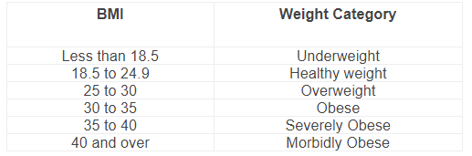

# Predicting Annual Medical Expenses

#### Chris Richards
#### Practicum 1, Summer 2020
#### Regis University

## Overview
### Project goal
Assess various predictive models for predicting the dollar amount of annual health care spending.

## Resources/libraries
•	Python 3  
* Jupyter Notebooks  

### Libraries: 
Pandas, numpy, sci-kit learn, pandas profiling, graphviz, seaborn, matplotlib, xgboost, phik, statsmodels, scipy

example of image link:

